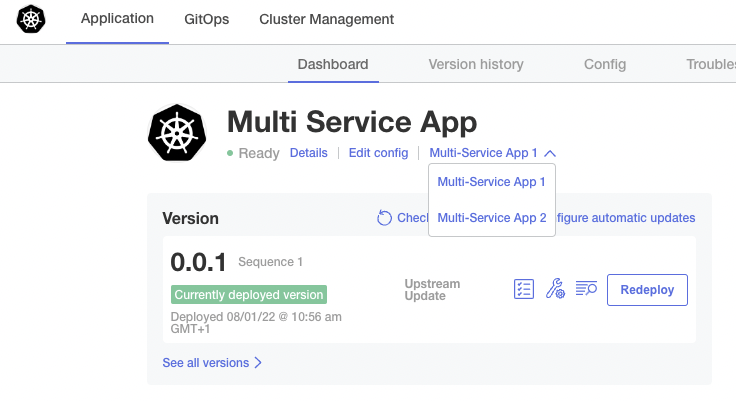

# Replicated vendor portal app manifest files to show drop down menu app launcher in kotsadm
Manifest files for the replicated vendor portal to deploy an app with launch menu for multiple endpoints



This is defined in the k8s-app.yaml file:
```
apiVersion: app.k8s.io/v1beta1
kind: Application
metadata:
  name: "multisvcapp"
spec:
  descriptor:
    links:
      - description: Multi-Service App 1
        url: "http://nginx1"
      - description: Multi-Service App 2
        url: "http://nginx2"
```

The url is translated using the details from the kots-app.yaml:
```
apiVersion: kots.io/v1beta1
kind: Application
metadata:
  name: multisvcapp
spec:
  title: "Multi Service App"
  statusInformers:
    - deployment/nginx1
    - deployment/nginx2
  ports:
    - serviceName: "nginx1"
      servicePort: 80
      localPort: 8081
      applicationUrl: "http://nginx1"
    - serviceName: "nginx2"
      servicePort: 80
      localPort: 8082
      applicationUrl: "http://nginx2"
```
Note also the [statusInformers](https://docs.replicated.com/vendor/admin-console-display-app-status) that show component status on the Details popup dialogue.

